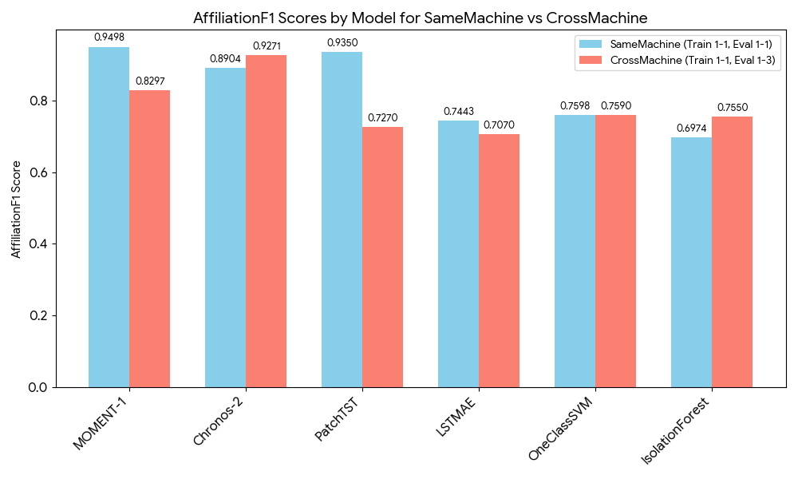
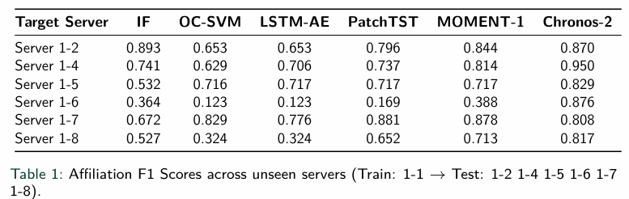
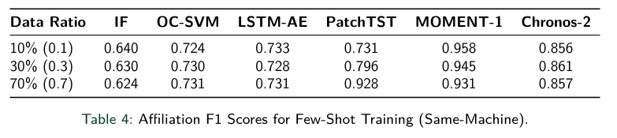
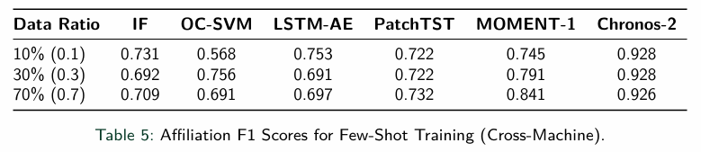
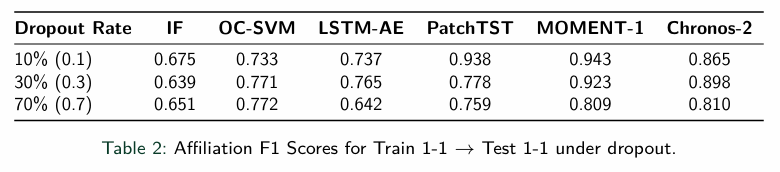
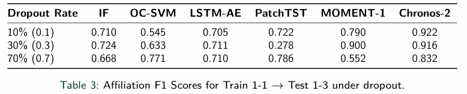

# Transformer-Based-Anomaly-Detection-Using-Time-Series-Foundation-Models

### Introduction :

---

Anomaly detection in industrial time series is challengedby two persistent limitations: the cold-start problem, wherein conventional machine learning models require substantial historical data before deployment, and generalization failure, wherein models trained on one machine degrade severely on unseen hardware. This project investigates whether large pre-trained time series foundation models (TSFMs), fine-tuned via parameter-efficient Low-Rank Adaptation (LoRA), can overcome these limitations on the Server Machine Dataset (SMD).

---

### Baselines :

---

Isolation Forest 
One Class SVM 
LSTM Autoencoder 
PatchTST 

---

### Time Series Foundation Models :

---

MOMENT-1 
Chronos-2 

---

### Dataset :

---

[ServerMachineDataset](https://github.com/NetManAIOps/OmniAnomaly/tree/master/ServerMachineDataset)

Train : `./train/machine-1-1.txt` 
Test : `./test/machine-1-1.txt` (Same-Server/Machine) 
Test : `./test/machine-1-3.txt` (Cross-Server/Machine) 

---

### Fine-Tuning / Training Setup :

---

#### Baselines :

`window_size` : 100 

Isolation Forest -  

`n_estimators`  : 100 
`contamination` : auto 
`max_samples`  : 256 

One Class SVM -  

`nu` : 0.01 

LSTM Autoencoder - 

`num_epochs` : 10 
`learning_rate` : 1e-4 
`batch_size` : 128 
`hidden_dims` : 64 
`latent_dim` : 16 
`n_channels` : 38, 
`hidden_dims` : hidden_dims 
`latent_dim` : latent_dim 
`num_layers` : 2 
`dropout` : 0.1 
`optimizer` : AdamW 
`loss_fn` : MSE 
`anomaly_score` : MSE 

PatchTST - 

`num_epochs` : 10 
`learning_rate` : 1e-4 
`batch_size` : 128 
`patch_length` : 10 
`stride` : 10 
`d_model` : 128 
`d_ff` : 256 
`n_heads` : 4 
`n_layers` : 3 
`n_channels` : 38 
`optimizer` : AdamW 
`loss_fn` : MSE 
`anomaly_score` : MSE 

---

#### Time Series Foundation Models :

`window_size` : 96 

MOMENT-1 - 

`model` : MOMENT-1-base 
`num_epochs` : 7 
`learning_rate` : 5e-5 
`batch_size` : 16 
`n_channels` : 38 
`task` : "reconstruction" 
`r` : 8 
`lora_alpha` : 16 
`target_modules` : ["q", "v"] 
`lora_dropout` : 0.05 
`modules_to_save` : ["head"] 
`bias` : "none" 
`max_norm` : 1. 
`optimizer` : AdamW 
`scheduler` : OneCycleLR 
`loss_fn` : MSE 
`anomaly_score` : MSE 

Chronos-2 - 

`model` : chronos-2 
`num_epochs` : 7 
`learning_rate` : 5e-5 
`batch_size` : 16 
`n_channels` : 38 
`task` : "forecasting" 
`r` : 8 
`lora_alpha` : 16 
`target_modules` : ["q", "v"] 
`lora_dropout` : 0.05 
`modules_to_save` : ["head"] 
`bias` : "none" 
`forecasting_horizon` : 16 
`max_norm` : 1.0 
`optimizer` : AdamW 
`scheduler` : OneCycleLR 
`loss_fn` : Full Pinball Loss 
`anomaly_score` : CRPS 

---

### Experiments :

---

### Extended Cross-Server Evaluation :

Train : `machine-1-1.txt` 

Test : 

`machine-1-3.txt` 
`machine-1-4.txt` 
`machine-1-5.txt` 
`machine-1-6.txt` 
`machine-1-7.txt` 
`machine-1-8.txt` 

---

#### Few Shot Learning :

Few Shot Rates : 

0.1 
0.3 
0.7 

---

#### Sensor Dropout Rate :

Sensor Dropout Rates : 

0.1 
0.3 
0.7 

---

### Results :

---

#### Same-Server And Cross-Server Test :

---

#### Extended Cross-Server Evaluation :

---

#### Few-Shot Learning Test :

##### Same-Server :

##### Cross-Server :

---

#### Sensor Dropout Test :

##### Same-Server :

##### Cross-Server :

---

### Acknowledgement :

---

This project was developed in a Summer Internship at the EMC^2 Lab, Veermata Jijabai Technological Institute (VJTI), Mumbai, under the guidance of Prof. Madhavi Parimi and Dr. S.R. Wagh.
EMC Lab Website: https://emcc.in/

---

### License :

---

Distributed under the MIT License

---